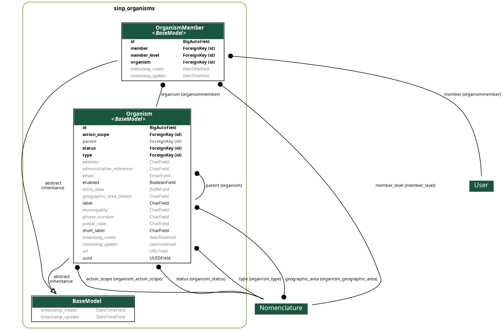

# GETTING STARTED

## Available endpoints

- `/organisms/` > list all organisms
- `/organisms/<int:pk>` > retrieve one organism by organism id
- `/organisms/<int:pk>/members` > retrieve one organism members by organism id

## Dependencies

- Django Rest Framework

## Installation

```bash
pip install -U dj-sinp-organisms
```

## Configuration

Configure `INSTALLED_APPS`:

```python
INSTALLED_APPS = (
    'django.contrib.admin',
    'django.contrib.auth',
    (...),
    'rest_framework',
    'jsondata_manager',
    (...),
)
```

Configure `urls.py`:

```python
urlpatterns = [
    path('admin/', admin.site.urls),
    path('api-auth/', include('rest_framework.urls')),
    (...),
    path('api/v1/', include('jsondata_manager.urls')),
    (...),
]
```

## Models


